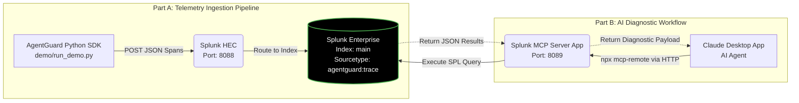

# AgentGuard

**Multi-agent AI observability for Splunk** — instrument agents with a Python SDK, stream spans via HEC, investigate failures with SPL dashboards and an MCP server for Claude.

[](https://pypi.org/project/agentguard/)

```bash
pip install agentguard
```

## Architecture



## Pitch

AgentGuard instruments multi-agent AI systems with a lightweight Python SDK, streams execution traces into Splunk via HEC, surfaces failure patterns in real-time SPL dashboards, and exposes a Splunk MCP server so Claude can query telemetry to explain why agents failed.

## Ports (important)

| Service | URL | Purpose |
|---------|-----|---------|
| **Splunk Web** | `http://localhost:8000` | Splunk UI, dashboards, HEC token setup |
| **AgentGuard Django** | `http://localhost:8001` | Span ingest API, alert webhooks |
| **Splunk HEC** | `https://localhost:8088` | SDK sends spans here |
| **Splunk REST** | `https://localhost:8089` | MCP / Claude queries |

Do **not** run Django on port 8000 — that port belongs to Splunk. Splunk URLs like `/en-GB/app/...` will 404 on Django.

## Docker (share with a teammate)

**Prerequisites:** Docker Desktop only.

```bash
cp .env.docker.example .env
docker compose up --build -d
docker compose run --rm demo
```

- API: http://localhost:8001/api/v1/agents/
- Full guide: [DOCKER.md](DOCKER.md)

## Quick start (local Python)

### 1. SDK + demo agents

Requires **Python 3.10+** (3.11 recommended).

```bash
python3.11 -m venv venv && source venv/bin/activate
pip install -r requirements.txt
pip install -e sdk/

cp .env.example .env   # set SPLUNK_HEC_URL + SPLUNK_HEC_TOKEN

python demo/run_demo.py --cycles 3
python demo/inject_failure.py
```

Backend-only (no Splunk):

```bash
AGENTGUARD_BACKEND_URL=http://localhost:8001 python demo/run_demo.py --backend-only
```

### 2. Django backend (optional mirror)

```bash
cd backend
python manage.py makemigrations api   # first time only
python manage.py migrate
python manage.py runserver 8001
# GET http://localhost:8001/api/v1/agents/
# GET http://localhost:8001/api/v1/health/
```

Optional ingest auth:

```bash
# Legacy env key (dev)
export AGENTGUARD_API_KEY=dev-secret

# Or hashed SDK key (production-style)
python manage.py createsuperuser   # once, for JWT
python manage.py create_sdk_key --name ingest
# Use Authorization: Api-Key ag_…
# JWT: POST /api/v1/auth/token/  then manage keys at /api/v1/auth/keys/
```

Async ingest (Celery + Redis):

```bash
export ASYNC_SPAN_INGEST=1 CELERY_TASK_ALWAYS_EAGER=0
celery -A promptops_backend worker -Q spans,metrics,celery -l info
# or: docker compose --profile async up --build -d
```

### 3. Splunk HEC

See [splunk_app/README.md](splunk_app/README.md). Search:

```spl
index=main sourcetype=agentguard:trace status=FAILED
```

### 4. MCP server

```bash
pip install mcp
SPLUNK_MOCK=1 python mcp_server/server.py
```

With Django fallback when Splunk is unavailable:

```bash
SPLUNK_MOCK=0 AGENTGUARD_BACKEND_URL=http://localhost:8001 python mcp_server/server.py
```

Tools: `search_agent_traces`, `explain_agent_failure`, `agent_health_summary`, `nl_search`, `anomaly_detection`, `failure_rate_analysis`, `alert_summary`, `check_ai_features`

### 5. Seer (governed investigation)

Agent-native closed loop: detect failure spikes in AgentGuard traces, correlate over an exact window, draft + audit a root cause, propose a validated remediation diff, publish the walk to Splunk HEC.

```bash
SPLUNK_MOCK=1 python -m seer investigate --persist --no-hec
python -m seer.verify .agentguard/ledgers/<run_id>.jsonl

# MCP: driver only sees step()
SPLUNK_MOCK=1 python -m seer.mcp_step
```

Details: [seer/README.md](seer/README.md)

### 6. Hackathon demo (24h sprint)

```bash
chmod +x scripts/setup.sh
./scripts/setup.sh

# Terminal 1
cd backend && python manage.py runserver 8001

# Terminal 2
python scripts/demo.py --traces 150 --backend-only
```

Layers added for demo day:

| Layer | What | Files |
|-------|------|-------|
| Splunk AI Assistant | NL → SPL (rule-based fallback) | `mcp_server/ai_assistant.py` |
| MLTK / anomaly | `DensityFunction` or `anomalydetection` | `splunk_app/mltk_setup.py`, saved searches |
| Smart alerting | Splunk webhooks → Django | `splunk_app/default/alerts.conf`, `sdk/agentguard/alert_handler.py` |

Live Splunk: set `SPLUNK_MOCK=0`, `SPLUNK_HEC_*`, `SPLUNK_REST_TOKEN`, optional `SPLUNK_AI_ASSISTANT_ENABLED=1`.

## Repo layout

| Path | Purpose |
|------|---------|
| `sdk/agentguard/` | SDK: `@trace_agent`, `@trace_tool`, HEC + backend exporters |
| `backend/` | Django + DRF span ingest |
| `demo/` | psutil infrastructure monitors |
| `mcp_server/` | Splunk MCP tools + AI Assistant NL→SPL |
| `seer/` | Governed investigation FSM, ledger, correlate, remediate |
| `splunk_app/` | SPL saved searches, alerts, MLTK setup |
| `scripts/` | `setup.sh`, `demo.py` hackathon pipeline |
| `DOCKER.md` | Docker Compose setup for teammates |
| `docker-compose.yml` | API + PostgreSQL + Redis |
| `IMPLEMENTATION_PLAN.md` | Full build roadmap |


