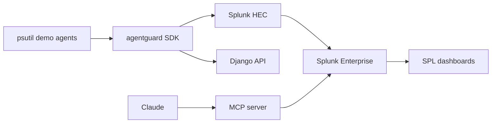

# AgentGuard

**Multi-agent AI observability for Splunk** — instrument agents with a Python SDK, stream spans via HEC, investigate failures with SPL dashboards and an MCP server for Claude.

[](https://pypi.org/project/agentguard/)

```bash
pip install agentguard
```

## Architecture



## Pitch

AgentGuard instruments multi-agent AI systems with a lightweight Python SDK, streams execution traces into Splunk via HEC, surfaces failure patterns in real-time SPL dashboards, and exposes a Splunk MCP server so Claude can query telemetry to explain why agents failed.

## Quick start

### 1. SDK + demo agents

Requires **Python 3.10+** (3.11 recommended).

```bash
python3.11 -m venv venv && source venv/bin/activate
pip install -r requirements.txt
pip install -e sdk/

cp .env.example .env   # set SPLUNK_HEC_URL + SPLUNK_HEC_TOKEN

python demo/run_demo.py --cycles 3
python demo/inject_failure.py
```

Backend-only (no Splunk):

```bash
AGENTGUARD_BACKEND_URL=http://localhost:8000 python demo/run_demo.py --backend-only
```

### 2. Django backend (optional mirror)

```bash
cd backend
python manage.py makemigrations api   # first time only
python manage.py migrate
python manage.py runserver
# GET http://localhost:8000/api/v1/agents/
```

Optional ingest auth: set `AGENTGUARD_API_KEY` in `.env` (SDK sends `Authorization: Api-Key ...`).

### 3. Splunk HEC

See [splunk_app/README.md](splunk_app/README.md). Search:

```spl
index=main sourcetype=agentguard:trace status=FAILED
```

### 4. MCP server

```bash
pip install mcp
SPLUNK_MOCK=1 python mcp_server/server.py
```

With Django fallback when Splunk is unavailable:

```bash
SPLUNK_MOCK=0 AGENTGUARD_BACKEND_URL=http://localhost:8000 python mcp_server/server.py
```

Tools: `search_agent_traces`, `explain_agent_failure`, `agent_health_summary`

## Repo layout

| Path | Purpose |
|------|---------|
| `sdk/agentguard/` | SDK: `@trace_agent`, `@trace_tool`, HEC + backend exporters |
| `backend/` | Django + DRF span ingest |
| `demo/` | psutil infrastructure monitors |
| `mcp_server/` | Splunk MCP tools |
| `splunk_app/` | SPL saved searches + dashboard guide |
| `IMPLEMENTATION_PLAN.md` | Full build roadmap |

## Legacy PromptOps

Prompt/eval APIs under `/api/v1/prompts/` remain for reference. New work uses AgentGuard spans only.

## License

MIT
